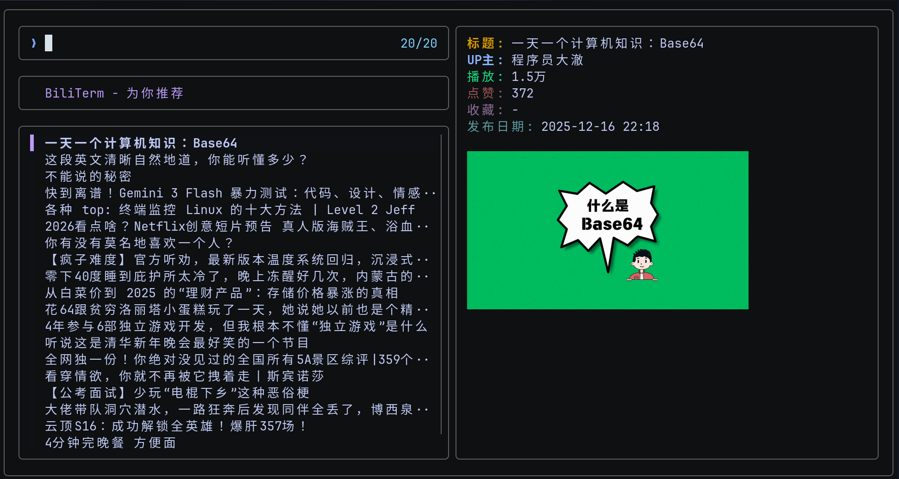

# Bili-Term

终端中的 Bilibili 客户端 | Terminal Bilibili Client

<p align="center">
  
  
</p>

## 预览



## 功能特性

- **视频浏览** - 推荐视频、热门视频、搜索视频
- **UP 主搜索** - 按名称搜索 UP 主及其视频
- **个人功能** - 个人推荐、历史记录、稍后观看
- **视频播放** - 使用 mpv 播放，支持播放列表
- **视频下载** - 使用 yt-dlp 下载视频
- **封面预览** - 使用 chafa 在终端显示图片
- **扫码登录** - 支持大会员账号登录
- **主题定制** - 支持自定义颜色方案

## 依赖

| 依赖     | 说明         |
| -------- | ------------ |
| `curl`   | HTTP 请求    |
| `jq`     | JSON 解析    |
| `fzf`    | 模糊搜索界面 |
| `chafa`  | 图片终端显示 |
| `mpv`    | 视频播放器   |
| `yt-dlp` | 视频下载     |

## 安装

### 方式一：使用安装脚本

```bash

curl -sSfL "https://raw.githubusercontent.com/akirco/bili-term/refs/heads/main/install.sh" | bash

#or

git clone https://github.com/akirco/bili-term.git
cd bili-term
./install.sh
```

### 方式二：手动安装

```bash
# 1. 安装依赖

# Arch
sudo pacman -S curl jq fzf chafa yt-dlp

# 3. 安装脚本
mkdir -p ~/.local/bin
cp bili.sh ~/.local/bin/bili
chmod +x ~/.local/bin/bili

# 4. 添加到 PATH
echo 'export PATH="$HOME/.local/bin:$PATH"' >> ~/.bashrc
source ~/.bashrc
```

## 使用

```bash
bili
```

## 快捷键

### 主菜单

| 按键     | 功能         |
| -------- | ------------ |
| `Enter`  | 选择功能     |
| `Ctrl+R` | 刷新登录状态 |
| `Ctrl+W` | 稍后观看列表 |

### 视频列表

| 按键        | 功能             |
| ----------- | ---------------- |
| `Enter`     | 播放选中视频     |
| `Alt+Enter` | 播放当前列表     |
| `Ctrl+D`    | 下载视频         |
| `Ctrl+W`    | 添加到稍后观看   |
| `Ctrl+R`    | 刷新列表         |
| `Esc`       | 返回上级         |
| `?`         | 切换预览窗口位置 |

## 配置

配置文件位置：`~/.config/bili-term/config.conf`

```bash
# 播放器设置
VIDEO_PLAYER="mpv"
PLAYER_ARGS=""

# API 超时时间（秒）
API_TIMEOUT=10
API_RETRY=3

# 缓存设置
ENABLE_CACHE="true"
CACHE_DURATION=3600

# 分页大小
RECOMMEND_PAGE_SIZE=20
POPULAR_PAGE_SIZE=20
SEARCH_PAGE_SIZE=20

# 预览设置
ENABLE_PREVIEW="true"
SHOW_STATISTICS="false"
PREVIEW_WIDTH=50

# 快捷键
KEY_PLAY="enter"
KEY_PLAY_ALL="alt-enter"
KEY_DOWNLOAD="ctrl-d"
KEY_REFRESH="ctrl-r"
KEY_WATCHLATER="ctrl-w"

DOWNLOAD_DIR="$HOME/Videos/bilibili/downloads"
```

## 目录结构

```
~/.config/bili-term/
├── config.conf      # 配置文件
└── cookies.txt      # 登录凭证

~/.cache/bili-term/
└── *                # 缓存文件

~/.local/share/bili-term/
└── *                # 数据文件
```

## 环境变量

| 变量             | 说明         | 默认值   |
| ---------------- | ------------ | -------- |
| `VIDEO_PLAYER`   | 视频播放器   | `mpv`    |
| `PLAYER_ARGS`    | 播放器参数   | ``       |
| `API_TIMEOUT`    | API 超时(秒) | `10`     |
| `ENABLE_PREVIEW` | 启用封面预览 | `true`   |
| `FZF_COLOR`      | fzf 颜色方案 | 内置方案 |

## 故障排除

### 412 错误

如果遇到 API 412 错误，可能需要：

1. 登录账号后重试
2. 检查 cookie 是否有效

### 封面不显示

确保已安装 `chafa`：

```bash
# Arch
sudo pacman -S chafa

```

### 播放失败

1. 确保 mpv 已安装
2. 检查 cookie 文件是否有效
3. 尝试添加 `--ytdl-raw-options="cookies=cookie.txt"`

## License

MIT License
